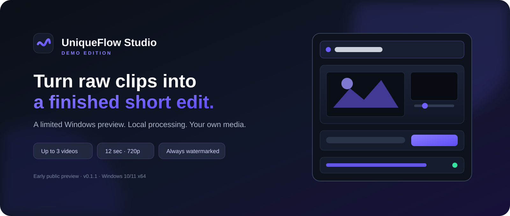

  

  <a href="https://chernoivanenko45.github.io/UniqueFlow-Studio-Demo/"><b>Open the Full Beta page</b></a> ·
  <a href="README_RU.md"><b>Русская версия</b></a> ·
  <a href="https://t.me/zloy_tomych"><b>Telegram @zloy_tomych</b></a>

# UniqueFlow Studio — Full Beta

UniqueFlow Studio is a local-first Windows editor that turns source clips and music into a finished short edit. The temporary **Full Beta 0.9.0-rc1** provides the actual Standard and Deep AI workflows for evaluation; it is not an open-source release.

## Included in the beta

- Beat-aware Standard montage
- Deep AI Director with scene and music analysis
- AI tracking and automatic reframing
- Video enhancement and Photo AI
- Variant export and local result history
- Optional downloader and Telegram integration with the user's own bot token
- Russian and English interface
- Local media processing with no telemetry

Face Swap is disabled while redistribution rights for its model stack are reviewed.

## Download and installation

1. Open the [official beta page](https://chernoivanenko45.github.io/UniqueFlow-Studio-Demo/).
2. Use **Download Full Beta** while the testing group is open.
3. Verify the installer SHA-256 shown on the page.
4. Run the installer and follow the setup wizard.

The package is about 902 MiB and includes the required runtime components. The current build is unsigned, so Windows SmartScreen may show an “Unknown publisher” warning.

## Privacy and responsible use

Selected media and generated results stay on the user's computer. Network access occurs only for explicitly requested functions such as permitted downloads, tool updates or the user's Telegram bot. See [PRIVACY.md](PRIVACY.md) and [RESPONSIBLE_USE.md](RESPONSIBLE_USE.md).

Use only media you own or are allowed to process. Review every result before publishing it.

## License and feedback

UniqueFlow Studio is proprietary software. The beta is available for personal, non-commercial evaluation under [LICENSE.md](LICENSE.md). This repository is a product page and contains no production source code or private AI models.

- Bugs and ideas: [GitHub Issues](https://github.com/chernoivanenko45/UniqueFlow-Studio-Demo/issues)
- Direct contact: [Telegram @zloy_tomych](https://t.me/zloy_tomych)
- Third-party notices: [THIRD_PARTY_NOTICES.md](THIRD_PARTY_NOTICES.md)
- FFmpeg source information: [FFMPEG_SOURCE_OFFER.md](FFMPEG_SOURCE_OFFER.md)
