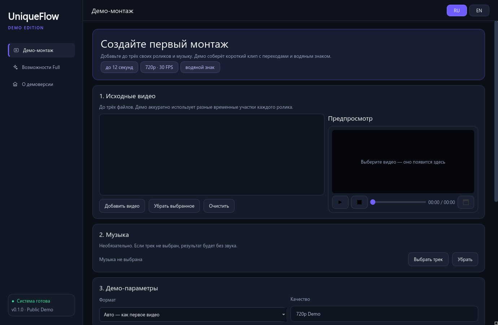

  

  <a href="README_RU.md"><b>Русская версия</b></a> ·
  <a href="https://github.com/chernoivanenko45/UniqueFlow-Studio-Demo/releases/latest"><b>Download latest demo</b></a> ·
  <a href="https://github.com/chernoivanenko45/UniqueFlow-Studio-Demo/issues"><b>Share feedback</b></a>

# UniqueFlow Studio — Public Demo

UniqueFlow Studio is a local-first Windows video editing project focused on turning source clips and music into a finished short edit with minimal setup.

This repository contains the **limited public Demo Edition**, created to collect honest early feedback. It is not the full AI product and it intentionally does not contain the proprietary editing engine or source code.

## Try it

1. Open [Releases](https://github.com/chernoivanenko45/UniqueFlow-Studio-Demo/releases/latest).
2. Download `UniqueFlowStudio_Demo_0.1.0_Portable.zip`.
3. Extract the complete archive to a normal folder.
4. Run `UniqueFlowStudioDemo.exe`.
5. Add up to three videos, optionally choose a music track, and create a short demo edit.

> This early preview is unsigned. Windows SmartScreen may display an “Unknown publisher” warning. Verify the SHA-256 value shown in the Release before running it.

## Demo Edition capabilities

- Up to 3 local source videos
- Different time ranges selected from every source
- Optional local music track
- Automatic vertical or horizontal output
- Short crossfade transitions
- 720p, 30 FPS H.264 output
- Up to 12 seconds per result
- Permanent visible `UniqueFlow Studio — DEMO` watermark
- Built-in source and result preview
- Russian and English interface
- Fully local processing with no telemetry

## Screenshot

## What is intentionally not included

| Module | Public Demo |
|---|---:|
| Basic demo montage | Included |
| Deep AI Director | Not included |
| Deep video understanding | Not included |
| Three AI drafts | Not included |
| AI tracking | Not included |
| Video enhancement / 2K AI x2 | Not included |
| Photo AI | Not included |
| Face Swap | Not included |
| Telegram bot and downloader | Not included |
| Variant export | Not included |

The demo uses a separate simplified renderer. The original production backend, AI models and premium modules are physically absent from the downloadable package.

## Privacy

Selected media is processed on your computer. The Demo Edition does not upload source videos, audio or results and does not contain analytics or telemetry. See [PRIVACY.md](PRIVACY.md).

## System requirements

- Windows 10 or Windows 11, 64-bit
- 4 GB RAM minimum
- Approximately 1 GB of free disk space plus space for results
- A standard modern CPU; a dedicated GPU is not required for the demo renderer

## Help shape the product

This preview exists to answer one question: **is UniqueFlow useful enough to keep developing?**

If the idea is interesting to you:

- star the repository;
- download and try the demo;
- open an [issue](https://github.com/chernoivanenko45/UniqueFlow-Studio-Demo/issues) with honest feedback;
- tell us which full-version feature you would want most.

## Responsible use

Use only media you own or are allowed to process. Do not use the application to impersonate people, violate privacy, evade platform rules or republish content without permission. See [RESPONSIBLE_USE.md](RESPONSIBLE_USE.md).

## License

UniqueFlow Studio is proprietary software. The public demo may be downloaded and evaluated under the terms in [LICENSE.md](LICENSE.md). This repository is a product showcase and is **not an open-source release**.

Third-party runtime notices and exact FFmpeg build/source information are available in [THIRD_PARTY_NOTICES.md](THIRD_PARTY_NOTICES.md) and [FFMPEG_SOURCE_OFFER.md](FFMPEG_SOURCE_OFFER.md).
