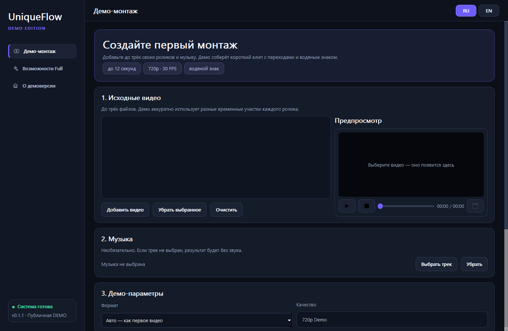
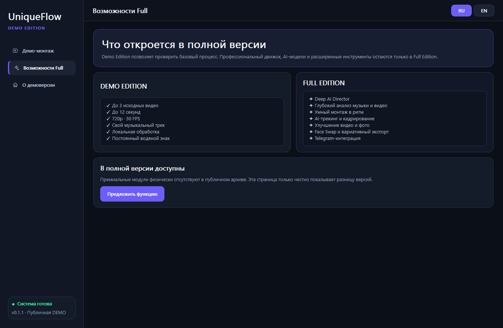

  

  <a href="README.md"><b>English version</b></a> ·
  <a href="https://github.com/chernoivanenko45/UniqueFlow-Studio-Demo/releases/latest"><b>Скачать демоверсию</b></a> ·
  <a href="https://github.com/chernoivanenko45/UniqueFlow-Studio-Demo/issues"><b>Оставить отзыв</b></a>

# UniqueFlow Studio — публичная демоверсия

UniqueFlow Studio — локальный Windows-редактор, который развивается вокруг простой идеи: добавить исходные ролики и музыку и получить готовый короткий монтаж без долгой ручной настройки.

Этот репозиторий содержит **ограниченную публичную Demo Edition** для сбора честных первых отзывов. Это не полная AI-версия. В демо намеренно отсутствуют исходный профессиональный движок, модели и исходный код.

## Как попробовать

1. Откройте раздел [Releases](https://github.com/chernoivanenko45/UniqueFlow-Studio-Demo/releases/latest).
2. Скачайте `UniqueFlowStudio_Demo_0.1.1_Portable.zip`.
3. Полностью распакуйте архив в обычную папку.
4. Запустите `UniqueFlowStudioDemo.exe`.
5. Добавьте до трёх видео, при желании выберите музыку и создайте короткий демо-монтаж.

> Это ранняя неподписанная сборка. Windows SmartScreen может показать предупреждение «Неизвестный издатель». Перед запуском сравните SHA-256 файла со значением в описании Release.

## Возможности Demo Edition

- До 3 локальных исходных видео
- Разные временные участки каждого выбранного ролика
- Свой музыкальный трек
- Автоматический вертикальный или горизонтальный формат
- Короткие плавные переходы
- Результат 720p, 30 FPS, H.264
- Продолжительность до 12 секунд
- Постоянный водяной знак `UniqueFlow Studio — DEMO`
- Просмотр исходника и результата внутри программы
- Русский и английский интерфейс
- Локальная обработка без телеметрии

## Интерфейс

### Сравнение с полной версией

## Чего в демоверсии нет

| Модуль | Публичная Demo |
|---|---:|
| Базовый демо-монтаж | Доступен |
| Deep AI Director | Нет |
| Глубокое понимание видео | Нет |
| Три AI-черновика | Нет |
| AI-трекинг | Нет |
| Улучшение видео / 2K AI x2 | Нет |
| Photo AI | Нет |
| Face Swap | Нет |
| Telegram-бот и загрузчик | Нет |
| Вариативный экспорт | Нет |

Демо использует отдельный упрощённый рендерер. Рабочий профессиональный backend, AI-модели и премиальные модули физически отсутствуют в скачиваемой сборке.

## Конфиденциальность

Выбранные видео и музыка обрабатываются на компьютере пользователя. Demo Edition не отправляет исходники и результаты в интернет, не содержит аналитики и телеметрии. Подробнее: [PRIVACY.md](PRIVACY.md).

## Системные требования

- Windows 10 или Windows 11, 64-bit
- Минимум 4 ГБ оперативной памяти
- Около 1 ГБ свободного места плюс место для готовых файлов
- Современный процессор; отдельная видеокарта для демо-рендера не требуется

## Помогите определить будущее проекта

Главная задача этой демоверсии — понять, действительно ли UniqueFlow интересен людям.

Если идея вам нравится:

- поставьте репозиторию звезду;
- скачайте и попробуйте Demo Edition;
- создайте [Issue](https://github.com/chernoivanenko45/UniqueFlow-Studio-Demo/issues) с честным отзывом;
- напишите, какая функция полной версии нужна вам больше всего.

## Ответственное использование

Используйте только собственные материалы или контент, на обработку которого у вас есть разрешение. Не используйте программу для нарушения приватности, выдачи себя за других людей, обхода правил площадок или незаконной публикации чужого контента. Подробнее: [RESPONSIBLE_USE.md](RESPONSIBLE_USE.md).

## Лицензия

UniqueFlow Studio — проприетарное программное обеспечение. Демоверсию можно скачать и оценить на условиях [LICENSE.md](LICENSE.md). Репозиторий является витриной продукта и **не является публикацией открытого исходного кода**.

Уведомления о сторонних компонентах и точные сведения о сборке/исходниках FFmpeg: [THIRD_PARTY_NOTICES.md](THIRD_PARTY_NOTICES.md) и [FFMPEG_SOURCE_OFFER.md](FFMPEG_SOURCE_OFFER.md).
